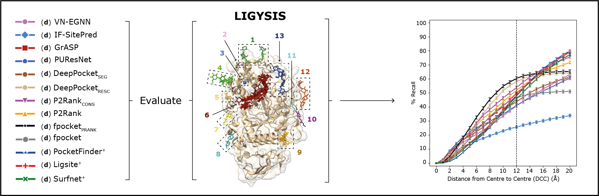

# LBS-comparison

This is the GitHub repository underlying the analysis for our manuscript "_Comparative analysis of methods for the prediction of protein-ligand binding sites_", which can be found [here](insert_ref).

In this work, we gather 13 ligand binding site predictors, spanning 30 years, focusing on the latest machine learning based methods, such as VN-EGNN, IF-SitePred, GrASP, PUResNet, and DeepPocket and comparing them to established methods such as P2Rank, PRANK and fpocket and earlier methods such PocketFinder, Ligsite and Surfnet. We compare these thirteen methods thoroughly and benchmark them against our curated reference dataset, LIGYSIS, to perform an objective assessment of their prediction capabilities. An informed ranking of the methods, as well as a series of reflections and guidelines to advance this field result as conclusions of this analysis, which represents the most thorough analytical comparison of ligand binding site prediction methods to date, offering a clear framework for future developments in the field of ligand binding site prediction.

## Dependencies

### Prediction methods

In this work, we compared the performance of eleven ligand binding site prediction methods, which are the following. Instructions to install them can be found in their respective repositories.

1. [VN-EGNN](https://github.com/ml-jku/vnegnn)  [[1]](https://arxiv.org/abs/2404.07194)
2. [IF-SitePred](https://github.com/annacarbery/binding-sites)  [[2]](https://jcheminf.biomedcentral.com/articles/10.1186/s13321-024-00821-4)
3. [GrASP](https://github.com/tiwarylab/GrASP)  [[3]](https://pubs.acs.org/doi/abs/10.1021/acs.jcim.3c01698)
4. [PUResNet](https://github.com/jivankandel/PUResNetV2.0)  [[4]](https://jcheminf.biomedcentral.com/articles/10.1186/s13321-024-00865-6)
5. [DeepPocketRESC](https://github.com/devalab/DeepPocket)  [[5]](https://pubs.acs.org/doi/10.1021/acs.jcim.1c00799)
6. [DeepPocketSEG](https://github.com/devalab/DeepPocket) [[5]](https://pubs.acs.org/doi/10.1021/acs.jcim.1c00799)
7. P2RankCONS  [[6]](https://academic.oup.com/nar/article/50/W1/W593/6591527)
8. [P2Rank](https://github.com/rdk/p2rank)  [[7]](https://jcheminf.biomedcentral.com/articles/10.1186/s13321-018-0285-8)
9. fpocketPRANK [[8]](https://link.springer.com/article/10.1186/s13321-015-0059-5)
10. [fpocket](https://github.com/Discngine/fpocket) [[9]](https://bmcbioinformatics.biomedcentral.com/articles/10.1186/1471-2105-10-168)
11. [PocketFinder+](https://compbio.cs.princeton.edu/concavity/)  [[10]](https://pubmed.ncbi.nlm.nih.gov/15757999/)
12. [Ligsite+](https://compbio.cs.princeton.edu/concavity/)  [[11]](https://pubmed.ncbi.nlm.nih.gov/9704298/#:~:text=Using%20a%20set%20of%20receptor,of%20LIGSITE%20is%20its%20speed.)
13. [Surfnet+](https://compbio.cs.princeton.edu/concavity/)  [[12]](https://pubmed.ncbi.nlm.nih.gov/8603061/)

P2RankCONS is the same programme as [P2Rank](https://academic.oup.com/nar/article/50/W1/W593/6591527), but passing an extra argument which contains evolutionary conservation information of the target protein.

fpocketPRANK are [fpocket](https://bmcbioinformatics.biomedcentral.com/articles/10.1186/1471-2105-10-168) prdictions re-scored with [PRANK](https://link.springer.com/article/10.1186/s13321-015-0059-5).

DeepPocketRESC corresponds to the default [DeepPocket](https://pubs.acs.org/doi/10.1021/acs.jcim.1c00799) implementation, i.e., re-scored and re-ranked fpocket predictions. DeepPocketSEG represents the pocket shapes extracted from the [DeepPocket](https://pubs.acs.org/doi/10.1021/acs.jcim.1c00799) CNN segmentation module. These predictions were obtained by removing the `-r  3` flag, and so pocket shapes were extracted for all pockets, and not just the top-3.

Methods 11-13 represent the implementations by Capra, _et al._, 2009, [[13]](https://journals.plos.org/ploscompbiol/article?id=10.1371/journal.pcbi.1000585) and are therefore indicated by the + superindex.

### Analysis

To run the analysis code, install the conda environment with the following dependencies:

`conda env create -f environment.yml`

or

`conda create -n lbs_comp_env python=3.10 scipy scikit-learn biopython pandas seaborn matplotlib numpy -c conda-forge`

#### Standard Python libraries
- [Scipy](https://scipy.org/)
- [Scikit-learn](https://scikit-learn.org/stable/)
- [Biopython](https://biopython.org/) 
- [Pandas](https://pandas.pydata.org/) 
- [Seaborn](https://seaborn.pydata.org/) 
- [Matplotlib](https://matplotlib.org/) 
- [Numpy](https://numpy.org/)

#### Additional dependencies

ProIntVar is used for some of the data processing. For installation instructions, refer here: [ProIntVar repository](https://github.com/bartongroup/ProIntVar/tree/JSU_branch).

The following are dependencies that were used for preotein and ligand site characterisation and visualisation:
- [POVME](https://github.com/durrantlab/POVME) [[14]](https://pubs.acs.org/doi/10.1021/ct500381c)
- [ProteinVolume](https://gmlab.bio.rpi.edu/PVolume.php)  [[15]](https://bmcbioinformatics.biomedcentral.com/articles/10.1186/s12859-015-0531-2)
- [freeSASA](https://freesasa.github.io/)  [[16]](https://f1000research.com/articles/5-189/v1)
- [ChimeraX](https://www.cgl.ucsf.edu/chimerax/)  [[17]](https://www.ncbi.nlm.nih.gov/pmc/articles/PMC7737788/)
- [PyMol](https://pymol.org/support.html)  [[18]](https://legacy.ccp4.ac.uk/newsletters/newsletter40/11_pymol.pdf)

## References

1. Sestak, F., et al., VN-EGNN: E(3)-Equivariant Graph Neural Networks with Virtual Nodes Enhance Protein Binding Site Identification. arXiv [cs.LG], 2024.
2. Carbery, A., et al., Learnt representations of proteins can be used for accurate prediction of small molecule binding sites on experimentally determined and predicted protein structures. J Cheminform, 2024. 16(1): p. 32.
3. Smith, Z., et al., Graph Attention Site Prediction (GrASP): Identifying Druggable Binding Sites Using Graph Neural Networks with Attention. J Chem Inf Model, 2024. 64(7): p. 2637-2644.
4. Jeevan, K., et al., PUResNetV2.0: a deep learning model leveraging sparse representation for improved ligand binding site prediction. Journal of Cheminformatics, 2024. 16(1): p. 66.
5. Aggarwal, R., et al., DeepPocket: Ligand Binding Site Detection and Segmentation using 3D Convolutional Neural Networks. J Chem Inf Model, 2022. 62(21): p. 5069-5079.
6. Jendele, L., et al., PrankWeb: a web server for ligand binding site prediction and visualization. Nucleic Acids Res, 2019. 47(W1): p. W345-W349.
7. Krivák, R. and D. Hoksza, P2Rank: machine learning based tool for rapid and accurate prediction of ligand binding sites from protein structure. J Cheminform, 2018. 10(1): p. 39.
8. Krivák R, Hoksza D. Improving protein-ligand binding site prediction accuracy by classification of inner pocket points using local features. J Cheminform. 2015 Apr 1;7:12. doi: 10.1186/s13321-015-0059-5. PMID: 25932051; PMCID: PMC4414931.
9. Le Guilloux, V., P. Schmidtke, and P. Tuffery, Fpocket: an open source platform for ligand pocket detection. BMC Bioinformatics, 2009. 10: p. 168.
10. An, J., M. Totrov, and R. Abagyan, Pocketome via comprehensive identification and classification of ligand binding envelopes. Mol Cell Proteomics, 2005. 4(6): p. 752-61.
11. Hendlich, M., F. Rippmann, and G. Barnickel, LIGSITE: automatic and efficient detection of potential small molecule-binding sites in proteins. J Mol Graph Model, 1997. 15(6): p. 359-63, 389.
12. Laskowski, R.A., SURFNET: a program for visualizing molecular surfaces, cavities, and intermolecular interactions. J Mol Graph, 1995. 13(5): p. 323-30, 307-8.
13. Capra JA, Laskowski RA, Thornton JM, Singh M, Funkhouser TA. Predicting protein ligand binding sites by combining evolutionary sequence conservation and 3D structure. PLoS Comput Biol. 2009 Dec;5(12):e1000585. doi: 10.1371/journal.pcbi.1000585. Epub 2009 Dec 4. PMID: 19997483; PMCID: PMC2777313.
14. Durrant, J.D., et al., POVME 2.0: An Enhanced Tool for Determining Pocket Shape and Volume Characteristics. J Chem Theory Comput, 2014. 10(11): p. 5047-5056.
15. Chen, C.R. and G.I. Makhatadze, ProteinVolume: calculating molecular van der Waals and void volumes in proteins. BMC Bioinformatics, 2015. 16(1): p. 101.
16. Mitternacht, S., FreeSASA: An open source C library for solvent accessible surface area calculations. F1000Res, 2016. 5: p. 189.
17. Pettersen, E.F., et al., UCSF ChimeraX: Structure visualization for researchers, educators, and developers. Protein Sci, 2021. 30(1): p. 70-82.
18. Schrödinger, L.L.C., The PyMOL Molecular Graphics System, Version 1.8. 2015.
